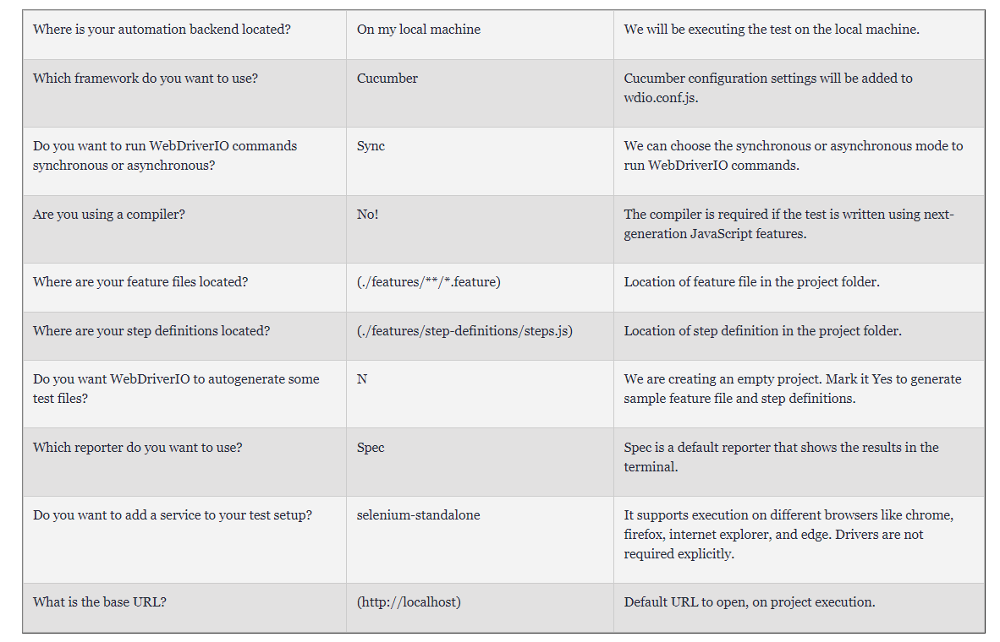
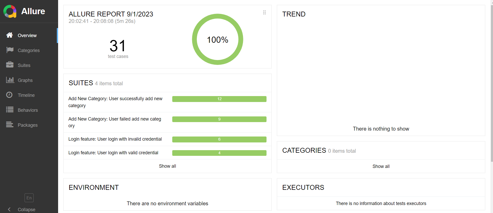

# Cucumber Javascript KasirAja

## Introduction
This repository was created to test UI of 
[KasirAja](https://kasirdemo.belajarqa.com/) web.
<br/> Technologies used:
<br/> [npm](https://www.npmjs.com/)
<br/> [Webdriver](https://www.npmjs.com/package/webdriver)
<br/> [Cucumber](https://www.npmjs.com/package/cucumber)
<br/> [Allure](https://www.npmjs.com/package/allure-commandline)

## Test Case and Test Scenario (Gherkin Syntax)
You can see the details of the test scenarios [here](https://docs.google.com/spreadsheets/d/1wAXiueSYq84DZX7H31OlkchtfaIaNKk9h9cRqQwf0Uw/edit#gid=762137455)

## Setup
### Pre-requisites
- Download and install Node.js
- Download and install any Text Editor like Visual Code
- Initilize the project with default settings npm init
- Install dependencies npm install
- Initilize webdriver via command line ```$ npm init wdio```
- Here is the complete setting about webdriver that used in this project 


### Setup Git Repository
- Clone the repository into a folder https://github.com/sofiaa53/cucumber_javascript.git
- Go to Project root directory and install Dependency: npm install
- All the dependencies from package.json would be installed in node_modules folder.

## Run Project
- Clone the project
- Open terminal
- Traverse to the project directory
- Run suite ```$ npm run wdio```
- Execution Example [Click Here](https://drive.google.com/file/d/1RRGBWZ1m8veig8EYRj-zQBZ7iOaoGBb0/view?usp=sharing)


# Reporting
The project uses reporter from [Allure](https://webdriver.io/docs/allure-reporter/)
- You can read the detail about the installation and how to setting on the config [here](https://dzone.com/articles/webdriverio-integration-with-cucumber)
- To generate the allure report, after run project execute this command: ```allure generate reports/allure-results/```
- Execute the command: ```allure open to view the allure``` report in a browser.
- Report Example !

## Author 
[Sofia Awiliyah](https://www.linkedin.com/in/sofia-awiliyah-365206192/) (QA Engineer, 2023)


## References
https://dzone.com/articles/webdriverio-integration-with-cucumber